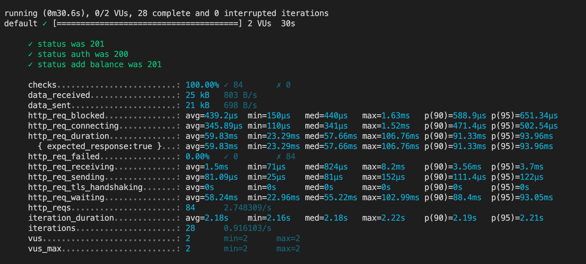

# k6-load-tests

Write simple load tests on https://app.swaggerhub.com/apis-docs/berpress/flask-rest-api/1.0.0

First, install k6 

```
https://k6.io/docs/getting-started/installation/
```

Next we need docker

```
docker pull litovsky/flask-api-test
docker run -d -p 56733:80 litovsky/flask-api-test
```

Open in browser and check
```
http://localhost:56733
```

Add tests for

1. register user (POST /register)
2. auth user (POST /auth)
3. add balance (POST /balance/{userId})

Run tests

```
k6 run script.js  
```

Result



For more information, see https://k6.io/docs/
